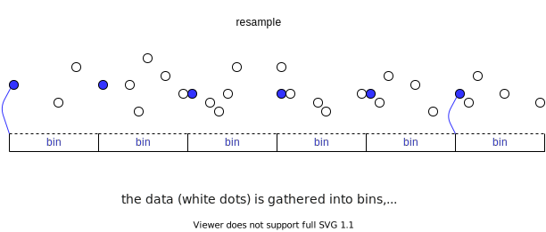
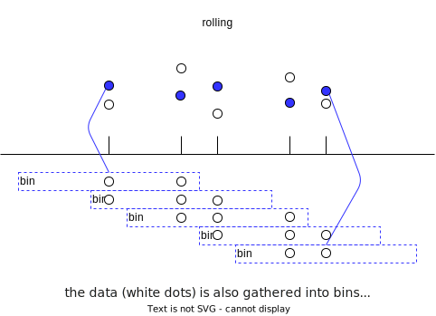

---
jupytext:
  custom_cell_magics: kql
  encoding: '# -*- coding: utf-8 -*-'
  text_representation:
    extension: .md
    format_name: myst
kernelspec:
  display_name: Python 3 (ipykernel)
  language: python
  name: python3
language_info:
  name: python
  nbconvert_exporter: python
  pygments_lexer: ipython3
nbhosting:
  title: "Les v\xE9los sur le pont de Fremont"
---

# timeseries en pandas

```{code-cell} ipython3
import pandas as pd
import numpy as np
import matplotlib.pyplot as plt
```

````{admonition} →

il est très fréquent d'avoir dans ses données des grandeurs qui représentent le temps; voyons un peu ce que `pandas` peut faire pour nous aider avec ce genre de traitements

le sujet est **extrêmement** vaste:  
- dualité date et heure, fuseaux horaires, formats `yy/mm/dd` vs `yy/dd/mm`
- jours fériés, années bissextiles, *leap seconds*, abandon du calendrier julien en 1582 mais pas partout, … 

bref on n'en donne ici qu'une version **très** édulcorée


````

+++

## les types de base 

### la version `Python`

````{admonition} →

en Python pur, on trouve dans la librairie standard [(`import datetime`)](https://docs.python.org/3/library/datetime.html) deux types de données principaux

* `datetime` qui permet de modéliser un instant (par exemple, le 10 octobre 1954 à 10h 32' 15'' - et même plus précis encore si nécessaire)
* `timedelta` qui permet de modéliser une durée (par exemple 2 heures 15 minutes, ou 3 ans)

si vous voulez les tester vous avez un exercice en annexe 1
````

```{code-cell} ipython3
# pas très PEP8 la librairie datetime...
from datetime import datetime
```

```{code-cell} ipython3
# dans le module datetime se trouve la classe datetime
# help(datetime)
```

### la version `numpy`

+++

````{admonition} →

ces deux types fournissent la bonne abstraction; malheureusement l'implémentation est sous-optimale pour les applications scientifiques, car notamment :

* ils ne couvrent pas les échelles infiniment grandes (temps astronomique)  
  ou infiniment petites (physique des particules)

* ils ne supportent pas la notion de valeur indéfinie, comme le `nan` pour les nombres

du coup on trouve [dans numpy](https://numpy.org/doc/stable/reference/arrays.datetime.html)
des versions plus flexibles et plus modernes de ces deux classes, qui s'appellent `np.datetime64` et `np.timedelta64`, qui n'ont pas ces lacunes

bref, ce sont **ces types qui seront utilisés** sous le capot, lorsqu'on aura à manipuler des grandeurs temporelles en `pandas`

```{admonition} la précision
dans les annexes de ce notebook, vous trouverez une table avec les précisions disponibles
```

````

+++

### la version `pandas`

+++

````{admonition} →

**mais** ici encore les types `numpy`, malgré leurs qualités, ont le gros défaut d'être très peu *user-friendly*, aussi `pandas` nous expose sa propre version de essentiellement les mêmes concepts, plus un:

* `Timestamp` pour un instant  
(aurait pu/dû s'appeler `Datetime`, mais bon...)

* `Timedelta` pour une durée
* `Period` pour un intervalle de temps, représenté par un début **et** une durée

ces types sont fabriqués *au dessus* des 2 types de base fournis par `numpy`, et visent donc principalement à les rendre plus faciles à utiliser

en `pandas` la fonction [pandas.to_datetime](https://pandas.pydata.org/docs/reference/api/pandas.to_datetime.html) vous permet de traduire des objets en date   
nous allons l'illustrer avec des exercices

````

+++

````{admonition} arithmétique

il est possible de faire de l'arithmétique entre ces objets; par exemple (TS = Timestamp, TD = Timedelta)

```text
TS + TS -> Erreur     # on ne peut pas ajouter deux dates
TS - TS -> TD         # mais on peut les soustraire
TS + TD -> TS         # et réciproquement ajouter 
TS - TD -> TS         # ou soustraire une durée à une date
TD // TD -> int       # ou faire un quotient 
TD % TD -> TD         # ou un reste
etc..
```
````

+++

## exercices: le cours de l'action amazon

+++

vous avez peut-être remarqué que `read_csv` propose des (tas d') options pour la gestion des instants (notamment le paramètre `parse_dates`)

dans un premier temps, nous allons rester loin de ce genre de features,    
et dans cet exercice nous allons procéder en deux temps, en combinant `pd.read_csv` et `pd.to_datetime`

```{code-cell} ipython3
# pd.read_csv?
```

```{code-cell} ipython3
# pd.to_datetime?
```

### exercice 1: `read_csv`

+++ {"tags": ["level_basic"]}

1. 1. lire le fichier de données `data/Amazon.csv` avec `read_csv()`  
   attention, le fichier contient 3 premières lignes de commentaires
   qu'il convient d'ignorer complètement  
   1. affichez les types des colonnes  
   que penser du type de la colonne `Date` ?

```{code-cell} ipython3
# à vous
```

### exercice 2: `pd.to_datetime()`

+++ {"tags": ["level_basic"]}

2. 1. traduisez la colonne `Date` dans le type adéquat  
   1. affichez le nouveau type de la colonne  
   1. ça peut être intéressant de regarder à la fois `dtypes` sur la dataframe et `dtype` sur la série (voir la note ci-dessous)  
   1. en option (pour les avancés): sauriez-vous passer à `to_datetime` le paramètre `format` qui va bien ?
      sachant que c'est une pratique **très recommandée** pour éviter les embrouilles

````{admonition} plusieurs choses là pour les curieux
:class: dropdown

 - la première est que `pandas` utilise les types de données `numpy`  
    en `pandas`, quand vous demandez le type des données d'une colonne, vous pouvez obtenir un nom de type `numpy`
 - la seconde est que la `repr()` et la `str()` du type `np.datetime64` sont différentes  
   (la `repr` dépend de votre ordinateur '<' est pour little-endian, 'M' est le le code caractère du type datetime et 8 la taille mémoire en octets) 
    ```python
    dt = np.datetime64("2023-09-12 15:30:00.000000000") # nano secondes
    print(repr(dt.dtype))
    -> dtype('<M8[ns]')
       (M est le code caractère du type datetime)
    print(str(dt.dtype))
    -> datetime64[ns]
    ```
````

```{code-cell} ipython3
# à vous
```

### exercice 3: `NaT`

+++ {"tags": ["level_basic"]}

3. 1. comparez l'affichage de la première ligne avec celui d'avant la conversion  
   que remarquez-vous ?  
   1. supprimer les lignes pour lesquelles le champ `Date` est inconnu

  pour vérifier vos résultats: le nombre de lignes doit passer de 5852 à 5828

```{code-cell} ipython3
# à vous
```

### exercice 4: l'accessor `.dt`

+++ {"tags": ["level_basic"]}

comme on l'a déjà vu avec `.str` et `.cat`  
il existe un accesseur `.dt` pour appliquer sur une série de type `Timestamp` des attributs qui lui sont spécifiques

+++ {"tags": ["level_basic"]}

4. 1. en utilisant cet accesseur, ajoutez à la dataframe une colonne qui contient uniquement l'année des dates
   1. pour les avancés: en utilisant cet accesseur, ajoutez à la dataframe une colonne qui contient le jour de la semaine  
   où lundi vaut 0, mardi 1, ...

+++

`````{admonition} beaucoup d'attributs disponibles
:class: dropdown

````{div}
bizarrement on ne trouve pas facilement la liste des attributs disponibles, voici un screenshot qui en montre une (toute petite) partie

```{image} media/Series-dt-screenshot.png
:width: 300px
:align: center
```
````
`````

```{code-cell} ipython3
# à vous
```

### exercice 5: indexons par les dates

+++ {"tags": ["level_basic"]}

5. mettez la colonne `Date` comme index  
   et triez la dataframe selon cet index
   (ça semble être déjà le cas, mais en est-on bien sûr ?)

pour les avancés, question subsidiaire:  
le fait de trier les dates va-t-il changer quelque chose à l'affichage des **points** e.g (`Date`, valeur de l'action) ?  
va-t-il changer quelque chose lorsqu'on va vouloir sélectionner des plages de temps à base de slicing (`.loc`) ?

```{code-cell} ipython3
# à vous
```

### exercice 6: plotting

+++ {"tags": ["level_basic"]}

6. 1. plottez la valeur de l'action au cours du temps

   * sur un même diagramme, les deux cours `High` et `Low`
   * ensuite sur deux diagrammes séparés

**indice**
on pourrait bien sûr utiliser `plt.plot()`  
mais ici on vous invite à utiliser directement la méthode `plot` sur une DataFrame, vous verrez que c'est beaucoup plus simple !

````{admonition} visus interactives
on pourra profiter de l'occasion pour expérimenter avec les visus interactives
qui sont rendues possibles avec 
```
%matplotlib widget
# ou de manière équivalente
%matplotlib ipympl
```

```{note} des soucis pour utiliser cela ?
:class: dropdown

il faut savoir que
- il est nécessaire d'installer `pip install ipympl` pour utiliser cela
- souvent on ne peut pas changer de *driver* matplotlib en cours de route sans redémarrer le kernel
```
````

```{code-cell} ipython3
# ceci nécessite un pip install ipympl
# décommentez pour essayer la visu interactive

%matplotlib ipympl
```

```{code-cell} ipython3
# pour changer la taille des figures par défaut

plt.rcParams["figure.figsize"] = (7, 2)
```

```{code-cell} ipython3
cols = ['High', 'Low']
```

```{code-cell} ipython3
# à vous
```

## slicing avec des dates

````{admonition} →

c'est très pratique de slicer un index qui contient des dates `Timestamp`

ici par exemple nous avons une granularité de la journée (sauf accident il y a une entrée par jour de la semaine)  
mais on peut slicer de manière assez naturelle

première commodité: on peut utiliser des chaines, pas besoin de mettre des objet `Timestamp` dans le slice

- voici les entrées entre le 1er avril 2020 et le 30 juin 2020  
  (rappel: comme on utilise `.loc` c'est inclus)
    ```python
    df.loc['2020-04-01' : '2020-06-30']
    ```
   


- encore plus simple: laissons le calculer les jours...
    ```python
    df.loc['2020-04' : '2020-06']
    ```

- et une année ?
    ```python
    df.loc['2019']
    ```

comment feriez-vous pour filtrer du 1er janvier 2019 jusqu'à la fin des données ?

***

si les dates de l'index ne sont pas ordonnées correctement, le slicing sera-il affecté ?  
non (et un peu oui)
- non parce que `pandas` ne sélectionnera bien sûr que les dates incluses dans l'intervalle indiqué
- oui parce que, dans la sous-dataframe obtenue, les dates seront ordonnées comme dans l'index
````

```{code-cell} ipython3
:tags: [raises-exception]

# on recharge pour être sûr

df = pd.read_csv('data/Amazon.csv', skiprows=3)
df['Date'] = pd.to_datetime(df.Date)
df.dropna(subset=['Date'], inplace=True)
df.set_index('Date', inplace=True)
df.head(2)
```

```{code-cell} ipython3
# et ça va jusque

df.tail(2)
```

```{code-cell} ipython3
:tags: [raises-exception]

# première commodité: on peut utiliser des chaines
# pas besoin de mettre des objet Timestamp dans le slice

# les entrées entre le 1er avril 2020 et le 30 juin 2020
# rappel: comme on utilise .loc c'est inclus

# on coupe aux 3 premiers pour ne pas envahir l'écran
df.loc['2020-04-01' : '2020-06-30'].head(3)
```

```{code-cell} ipython3
:tags: [raises-exception]

# mais en fait c'est encore plus simple d'écrire ce qui suit
# qui signifie, de avril à juin, toujours inclusivement

df.loc['2020-04' : '2020-06'].tail(3)
```

```{code-cell} ipython3
# toutes les données de l'année 2019

df.loc['2019'].head(3)
```

```{code-cell} ipython3
# à vous
# filtrer à partir du 1er janvier 2019 jusqu'à la fin des données
```

## aggrégations: `resample()` et `rolling()`

````{admonition} →
ces deux fonctions travaillent de la même façon:
- elles regroupent les données dans des *bins* (des corbeilles)
- toutes les données qui tombent dans une corbeille peuvent ensuite être agrégées  
  (comme d'habitude avec `mean()`, `sum()`, `min()`,…)

voyons pour commencer comment les corbeilles sont construites par ces deux fonctions
````

+++

## `resample()`

````{admonition} →
l'idée ici c'est de découper le temps en une partition, chaque corbeille ayant la même durée (sauf éventuellement celles aux extrémités)

dans ce modèle:

* chaque donnée de départ appartient à exactement une corbeille
* le nombre de corbeilles correspond, aux arrondis près, au rapport entre la durée totale et la durée de chaque corbeille



```{note}

dans l'illustration ci-dessus, chaque point bleu illustre **la moyenne** de chaque corbeille  
mais souvenez-vous que `resample()` ne fait que les corbeilles, pas l'agrégation  
aussi on a choisi d'attacher chaque point bleu au moment correspondant **au début** de chaque corbeille (et bien sûr c'est réglable..)
```
````

+++

### exemple 1: le supermarché

dans un supermarché, on vous donne une table avec une ligne par passage à la caisse (rien de régulier, donc)  
on veut calculer le chiffre d'affaires par tranche horaire

un simple resample sur 1 heure, en agrégant avec la somme, fournit le résultat

+++

### exemple 2: ré-échantillonner un signal sonore

vous avez un signal échantillonné à 44.100 kHz et vous voulez le ré-échantillonner (littéralement: *resample*) à une fréquence 4 fois plus basse.

il suffit de faire un resample avec une durée de corbeille égale à exactement 4 x la période de la fréquence originale, et agréger avec la moyenne

+++

### même type d'usages: `to_period()`

avec `resample()` on peut donc grouper les données par période  
signalons un autre outil qui peut aider à faire cela aussi en `pandas`, il s'agit de `to_period()` qui convertit un `Timestamp` en `Period` (un intervalle de temps), ce qui permet de faire ensuite un `groupby()` sur ces périodes.

voici un exemple simple pour illustrer cela;

```{code-cell} ipython3
# une table contenant des données éparpillées sur l'année 2024

ticks = pd.read_csv('data/ticks.csv')
ticks['time'] = pd.to_datetime(ticks.time)
ticks.head(4)
```

avec `to_period()`, on peut facilement ajouter une colonne qui va contenir, disons par exemple le mois calendaire correspondant

```{code-cell} ipython3
ticks['month'] = ticks.time.dt.to_period('M')
ticks.head(4)
```

````{admonition} autres fréquences utiles

on peut utiliser cette fonction avec des fréquences comme `'W'` (week) ou `'Y'` (year) ou même `'Q'` (quarter)
````

+++

ce qu'il faut remarquer c'est que les nouveaux champs sont donc **de type `Period`**, qui contient un début et une fin (et pas simplement un instant comme un `Datetime`)

```{code-cell} ipython3
ticks.dtypes
```

## `rolling()`
````{admonition} →

la fonction `rolling()` fonctionne aussi sur le modèle de corbeilles  
sauf que cette fois-ci, il ne s'agit plus d'une partition, mais de *fenêtre glissante*, comme illustré ci-dessous



donc cette fois-ci:

* une donnée appartient en général à plusieurs corbeilles
* on produit un nombre de corbeilles qui est de l'ordre de grandeur  
  du nombre de points de départ  
````

+++

````{admonition} au centre ou à droite
:class: dropdown tip

par défaut `rolling` attache la valeur *à la fin* de l'intervalle, ou dit autrement il va grouper les données qui sont à gauche du point dont on parle  
(on peut demander aussi de l'attacher au centre de l'intervalle, comme on l'a fait sur la figure)
````

+++

````{admonition} attention aux unités !
:class: dropdown

pour exprimer la durée de la fenêtre avec `rolling()`, il apparait qu'on ne peut pas utiliser les unités `W`, `M` ou `Y` qui sont, semble-t-il, susceptibles de varier en durée en fonction du moment de référence (pour le mois et l'année, ok, mais la semaine ?!?)

honnêtement c'est assez oiseux, notamment parce que `resample()` ne semble pas sujet à cette restriction..
````

+++

### exemple 1: visualiser l'évolution sur une année

vous voulez visualiser l'évolution d'une grandeur "d'une année sur l'autre"  

on va faire un rolling avec une période d'un an  
si on appelle $f$ la fonction de départ, et $F$ le rolling sur un an  
(avec la somme comme agrégation pour simplifier les équations), on va avoir

```{image} media/rolling-logic.png
:width: 400px
:align: right
```

calculons le rolling pour deux jours consécutifs; avec la convention qu'on fait une rolling sur le passé (le défaut, donc) on a

$$
F(31/12/2021) = \sum_{j=01/01/2021}^{31/12/2021} f(j) \\
\;et\; \\
F(01/01/2022) = \sum_{j=02/01/2021}^{01/01/2022} f(j)
$$

et donc la différence pour F entre deux jours consécutifs vaut

$$
F(01/01/2022) - F(31/12/2021) = f(01/01/20\textbf{22}) - f(01/01/20\textbf{21}) \\
$$

ce qui signifie que  
la dérivée de $F$ (la différence d'**un jour à l'autre**), c'est l'évolution de $f$ mais **d'une année sur l'autre**

+++

### exemple 2: effet lissant

pour bien voir l'effet 'lissant' de la fenêtre glissante, prenons des données synthétiques:

```{code-cell} ipython3
import numpy as np
```

```{code-cell} ipython3
:lines_to_next_cell: 2
:scrolled: true

# c'est l'occasion de voir comment créer des timeseries par programme
# ici 100 jours consécutifs

date_index = pd.date_range('2018-01-01', periods=100)

# un battement
X = np.arange(100)
s = pd.Series(10*np.cos(X/10) + 2*np.cos(X), index=date_index)

plt.figure()
s.plot();
```

voici l'effet du rolling avec des fenêtres de 1 semaine et 4 semaines

```{code-cell} ipython3
rolling_7 = s.rolling(window=pd.Timedelta(7, 'D'), center=True).mean()
rolling_28 = s.rolling(window=pd.Timedelta(28, 'D'), center=True).mean()
```

ici on a choisi d'attacher le résultat (de la moyenne de la corbeille) au **centre** de la corbeille

```{code-cell} ipython3
# pour afficher les 3 courbes à la fois

pd.DataFrame({
    'original': s,
    'roll 7D': rolling_7,
    'roll 28D': rolling_28,
}).plot();
```

### les bornes

juste pour bien illustrer le comportement aux bornes, voici

* le nombre de points dans la rolling: **autant de corbeilles que de points** (on le voit déjà ci-dessus)

* et le nombre de points par corbeille: **constant, sauf aux extrémités**

```{code-cell} ipython3
# exactement autant de corbeilles que de points

len(s), len(rolling_7)
```

```{code-cell} ipython3
# le nombre de points par corbeille

count_28 = s.rolling(window=pd.Timedelta(28, 'D'),
                     center=True).count()
pd.DataFrame({'points-per-bin-28': count_28}).plot();
```

+++ {"tags": ["level_intermediate"]}

## exercices / digression

+++ {"tags": ["level_intermediate"]}

la notion de fenêtre glissante - i.e. `rolling()` - fait du sens pour n'importe quelle donnée, même non-temporelle

reproduisez le dessin ci-dessus, mais

* en ne gardant que le rolling sur 4 semaines
* en indiquant une **fenêtre en nombre de points**

que constatez-vous aux extrémités ?

+++ {"tags": []}

### exercice 7: `resample` et `rolling`

+++ {"tags": ["level_basic"]}

7. calculez `df2` qui se concentre sur la valeur de `High` sur la période de Juillet 2018 à fin 2019  
plottez-la  
rangez dans la variable `L` le nombre de lignes

```{code-cell} ipython3
# à vous
```

### exercice 8: resample+plotting

+++ {"tags": ["level_basic"]}

8. appliquez à cette série un `resample()` avec la moyenne des données sur une période d'une semaine  
plottez le résultat  
combien d'entrées on devrait y trouver (en fonction de L) si on compare les fréquences des deux séries ?  
pourquoi ça ne tombe pas exactement juste ?  
est-ce qu'on pourrait estimer ça autrement ?

```{code-cell} ipython3
# à vous
```

### exercice 9: rolling+plotting

+++ {"tags": ["level_basic"]}

9. appliquez à cette série un `rolling()` avec une fenêtre de 1 an  
plottez le résultat  
combien d'entrées on devrait y trouver (en fonction de L) ?

```{code-cell} ipython3
# à vous
```

+++ {"tags": ["level_intermediate"]}

## Annexe 1 - les échelles de précision

+++ {"tags": ["level_intermediate"]}

un objet `datetime64` est créé avec un paramètre *`unit`*, qui permet de choisir la précision des calculs; et l'intervalle des dates possibles varie bien entendu avec cette précision :

+++ {"tags": ["level_intermediate"], "lines_to_next_cell": 2}

````{admonition} les échelles de précision
:class: note

le plus souvent on manipule des Timestamp qui ont une précision de la **ns**

Unit Code |	Meaning |	Time span (relative) |	Time span (absolute) |
-----|----------|------------------------|-----------------------|
Y |	year | 		+/- 9.2e18 years | 	[9.2e18 BC, 9.2e18 AD]
M |	month | 		+/- 7.6e17 years | 	[7.6e17 BC, 7.6e17 AD]
W |	week | 		+/- 1.7e17 years | 	[1.7e17 BC, 1.7e17 AD]
D |	day | 		+/- 2.5e16 years | 	[2.5e16 BC, 2.5e16 AD]
  |      |                       |
h |	hour | 		+/- 1.0e15 years | 	[1.0e15 BC, 1.0e15 AD]
m |	minute | 	+/- 1.7e13 years | 	[1.7e13 BC, 1.7e13 AD]
s |	second | 	+/- 2.9e11 years | 	[2.9e11 BC, 2.9e11 AD]
ms| millisecond | 	+/- 2.9e8 years | 	[ 2.9e8 BC, 2.9e8 AD]
us| microsecond | 	+/- 2.9e5 years | 	[290301 BC, 294241 AD]
**ns** | **nanosecond** | 	**+/- 292 years**  |	**[ 1678 AD, 2262 AD]**
ps| picosecond | 	+/- 106 days | 		[ 1969 AD, 1970 AD]
fs| femtosecond | 	+/- 2.6 hours | 		[ 1969 AD, 1970 AD]
as| attosecond | 	+/- 9.2 seconds | 	[ 1969 AD, 1970 AD]
````

+++

## Annexe 2 - le type de base Python `datetime`

````{admonition} →

en Python pur, on trouve dans la librairie standard [(`import datetime`)](https://docs.python.org/3/library/datetime.html) deux types de données principaux

* `datetime` qui permet de modéliser un instant (par exemple, le 10 octobre 1954 à 10h 32' 15'' - et même plus précis encore si nécessaire)
* `timedelta` qui permet de modéliser une durée (par exemple 2 heures 15 minutes, ou 3 ans)

**note**:  
on **n'utilise pas directement** ces deux types en pandas  
comme c'est tout de même la fondation du modèle, nous illustrons ici leur
````

```{code-cell} ipython3
:lines_to_next_cell: 2

# pour rester cohérent dans le nommage des classes
# je préfère les importer avec un nom conforme à la PEP008
from datetime import (
    datetime as DateTime,
    timedelta as TimeDelta)
```

```{code-cell} ipython3
# pour modéliser un instant

t1 = DateTime.fromisoformat('2021-12-31T22:30:00')
t1
```

```{code-cell} ipython3
# et une durée

d1 = TimeDelta(hours=4)
d1
```

### un peu d'arithmétique

```{code-cell} ipython3
# on peut faire de l'arithmétique
# avec ces deux types

# 4 heures après t1
t2 = t1 + d1
t2
```

```{code-cell} ipython3
# ajouter, soustraire, multiplier, diviser ...

# 8 haures avant ça, i.e. 4 heures avant d1
t2 - 2 * d1
```

```{code-cell} ipython3
# combien de fois 10 minutes dans 4 heures

d1 // TimeDelta(minutes=10)
```

### décomposer

+++

pour accéder aux différents éléments d'une date (année, mois, ..), c'est facile

```{code-cell} ipython3
t1.year, t1.hour
```

```{code-cell} ipython3
d1.days, d1.seconds
```

à titre plus anecdotique, on peut aussi appliquer directement un format à un instant dans une f-string

```{code-cell} ipython3
# %H c'est pour extraire l'heure
# il y a toute une série de codes de format...
f"{t1:%H==%M}"
```

par contre ces formats sont **très utiles** lorsqu'on va vouloir traduire nos fichiers d'entrée en date/heure

pour une liste complète des formats, voir
<https://docs.python.org/3/library/datetime.html#strftime-and-strptime-format-codes>
